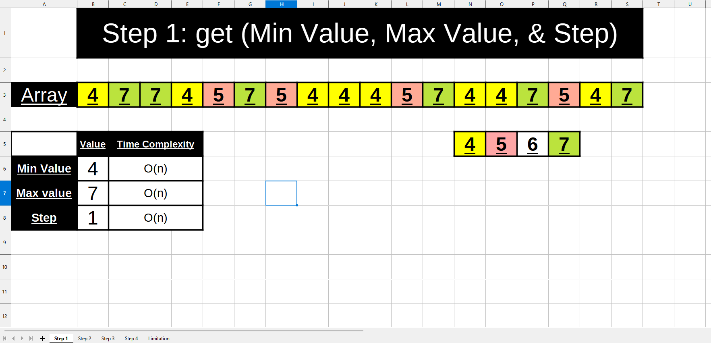
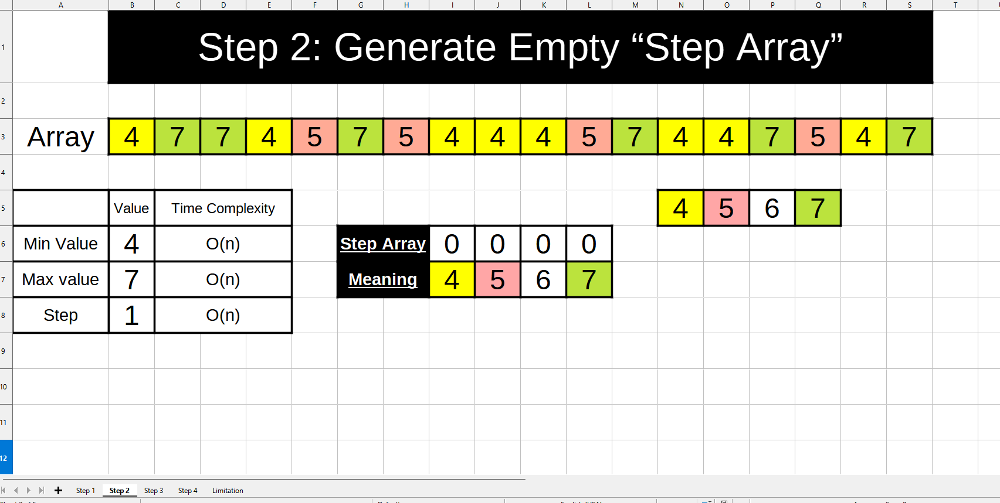
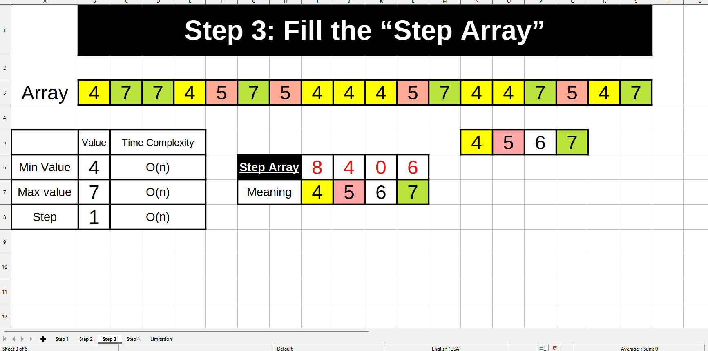
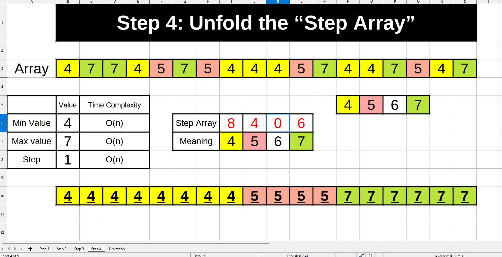
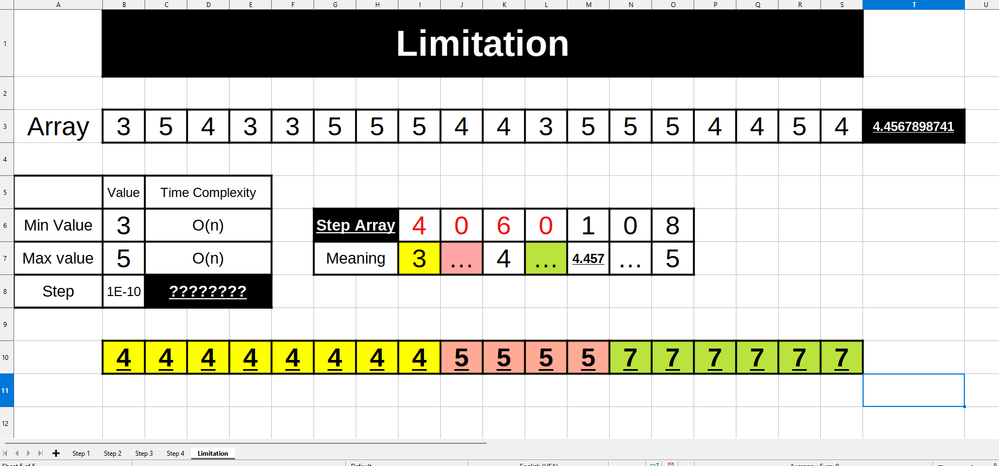

# Step Sort

Efficient sorting algorithm.  
This sorting algorithm has a Time Complexity of **`O(n)`**, **only if used
within the limitation** that I will talk about in the end.

# How it works:

It works on **`4 Steps`**:

## Step 1: get (Min Value, Max Value, & Step):



Iterate over each element of the list to get these three variables:

1. Minimum Value
2. Maximum Value
3. The Step (If not provided)

- Time Complexity: **`O(n)`**

## Step 2: Generate Empty “Step Array”:



Using the:

1. Minimum Value
2. Maximum Value
3. The Step

We can generate the Empty **`Step Array`**

## Step 3: Fill the “Step Array”:



Iterate over each element in the Step Array, and increment the value at the
correct index for that element.

## Step 4: Unfold the “Step Array”:



Let's apply on the example above:

- We create an empty list called `sorted_list`
- We Itrate on each element in the Step Array
  - First Element: Add 8 fours to sorted_list
  - Second Element: Add 4 fives to sorted_list
  - Third Element: Empty. Do not add any thing to sorted_list
  - Fourth Element: Add 6 sevens to sorted_list
- If `reversed` was true, reverse `sorted_list`
- return `sorted_list`

# The Limitation:



Since an array that can contain every possible element will be created, so it
souldn't be that the number of posibilities is very large.  
This is represented by the **`Step`**.

### For Example:

Let's imagine these two arrays:

- `[1, 2, 1, 1, 1, 1, 1, 1, 2, 2, 2, 2, 2, 2, 2, 2, 2, 2, 1, 1, 1, 1, 1]`
  - This is suitable
  - Min Value = 1, Max value = 2, step = 1
  - **`step_array`** = [12, 11]
    - 12 elements have the value of 1
    - 11 elements have the value of 2
- `[1, 1.065465789, 2, 1, 1, 1, 1, 1, 1, 2, 2, 2, 2, 2, 2, 2, 2, 2, 2, 1, 1, 1, 1, 1]`
  - Not suitable, You should use a general purpose sorting algorithm
  - Min Value = 1, Max value = 2, step = 0.000000001
  - **`step_array`** = [12, ...(Lots of zeros here)..., 1, ...(Lots of
    zeros here)..., 11]

If the limitation is not met, then there will be a huge consumtion in
computational recources.

### Examples where the limitation is met:

- `[1, 2, 2, 1, 1, 4, 4, 4, 4, 4]`
- `[0.1, -0.4, 1.1, 0.6]`
- `[0, 100, 200, 800, 400, -100]`

### Examples where the limitation NOT is met:

- `[0.87654512, 100.54546578, 2.2145468432]`

# Code:

- Code (Python): https://github.com/OmarThinks/StepSort/blob/master/Python/app.py
- Testing: https://github.com/OmarThinks/StepSort/blob/master/Python/test_app.py
- I also tried coding using JS and TS, but I stopped midway

## Custom Types:

- **`Number`**:
  - Code: `Number = Union[int, float]`
  - Explanation: a number, that can be Interger ot Float

# Function Parameters:

```python
def step_sort(
    numbers: List[Number],
    step: Optional[Number] = None,
    reversed: Optional[bool] = False,
    accuracy: Optional[int] = 12,
)
```

- **`numbers`**
  - Explanation: List of numbers to be sorted
  - Required: Yes
  - Type: `List[Number]`
  - Examples:
    - `[3, 6, 7, 4, 5, 6, 2]`
    - `[-1.1, 1.9, 5.7, 9, 5]`
- **`step`**
  - Explanation: The step between the numbers
  - Required: No
    - If not provided, it will be calculated.
    - But if provided it will save some calculation time
  - Type: `Number`
  - Condition:
    - `> 0`
  - Examples:
    - `1`
    - `0.1`
    - `100`
    - `2`
- **`reversed`**
  - Explanation:
    - If `True`: Order ascendingly
    - If `False`: Order descendingly
  - Required: No
  - Default Value: `False`
  - Type: `Boolean`
  - Examples:
    - `True`
    - `False`
- **`accuracy`**
  - Explanation:
    - This is NOT the step
    - This is the number of numbers after the floating point the be rounded at
    - Because divison is not very accurate in most programming langauges
  - Required: No
  - Default Value: `12`
  - Type: `Integer`
  - Examples:
    - `5`
    - `3`
